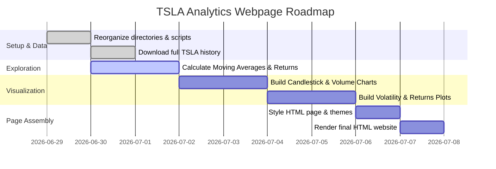

# Project Overview

The objective of this project is to build an interactive, visually stunning webpage using **Quarto (`.qmd`)** that analyzes Tesla's (`TSLA`) stock history from its IPO in 2010 to the present. We will use Python for data processing and visualization, aiming to create educational and interesting graphics that reveal trends, volatility, and trading patterns.

---

# Step-by-Step Project Pipeline

The project is structured into five sequential phases:



---

## Phase 1: Data Acquisition & Directory Setup
- [x] Create project structure (`code/`, `downloads/`).
- [x] Implement robust multi-source downloader that handles fallback options (Nasdaq API to Yahoo Finance).
- [x] Fetch full TSLA history from IPO (June 29, 2010) to current date (`tsla_all_historical.csv`).

---

## Phase 2: Data Exploration & Feature Engineering
Before creating graphics, we need to enrich the dataset with technical indicators that make for interesting visualizations:
* **Moving Averages (MA):**
  * Short-term: 20-day and 50-day Simple Moving Average (SMA).
  * Long-term: 200-day SMA (crucial for detecting Golden Crosses and Death Crosses).
* **Volatilities & Returns:**
  * Daily percentage return: $R_t = \frac{P_t - P_{t-1}}{P_{t-1}}$
  * 30-day rolling volatility (Standard Deviation of returns).
* **Trading Bands:**
  * Bollinger Bands (20-day SMA $\pm$ 2 standard deviations) to show overbought/oversold levels.

```python
#| label: feature-engineering
#| eval: false
#| echo: true
# Example code block for indicators:
import pandas as pd

df = pd.read_csv("../downloads/tsla_all_historical.csv")
df['date'] = pd.to_datetime(df['date'])

# Moving averages
df['sma_50'] = df['close'].rolling(window=50).mean()
df['sma_200'] = df['close'].rolling(window=200).mean()

# Daily Returns
df['daily_return'] = df['close'].pct_change()
```

---

## Phase 3: Interactive Visualizations
We will design at least four key interactive graphics using libraries like **Plotly** or **Altair** to allow zooming, panning, and hovering:

### 1. Candlestick & Moving Average Overlay
* **Visuals:** Candlesticks (Open, High, Low, Close) overlaid with 50-day and 200-day SMAs, plus a bar chart of volume at the bottom.
* **Goal:** Understand long-term trends and identify support/resistance levels.

### 2. Bollinger Bands Deviation Chart
* **Visuals:** Close price plotted alongside upper, middle, and lower Bollinger Bands with shaded bounds.
* **Goal:** Highlight periods of high volatility (squeezes) and potential price reversals.

### 3. Daily Returns & Volatility Clustering
* **Visuals:** Dual-axis chart showing daily returns as a scatter/line plot and rolling 30-day volatility as an area chart.
* **Goal:** Visualize volatility clustering (the phenomenon where high-volatility days are followed by high-volatility days).

### 4. Cumulative Returns & Drawdown Analysis
* **Visuals:** Peak-to-trough drop (%) line plot showing the maximum paper loss an investor would face during major corrections.
* **Goal:** Learn about investment risk, recovery times, and the scale of market corrections (e.g., 2022 bear market).

---

## Phase 4: Webpage Assembly & Styling
Quarto allows us to render `.qmd` files into highly customized HTML documents:
- **Theme Selection:** Select a modern theme (such as `slate` or `cosmo`, customized with custom CSS for dark mode/glassmorphism).
- **Responsive Layout:** Grid systems to arrange charts side-by-side or stacked on mobile devices.
- **Code Folding:** Keep the technical Python code tucked away in collapsible blocks (`code-fold: true`) so readers can focus on the graphics but easily inspect the source code if they choose.

---

## Phase 5: Rendering & Publishing
- Render the document locally to a single self-contained HTML page:
  ```bash
  quarto render project_outline.qmd --to html
  ```
- Make it hostable via GitHub Pages, Netlify, or local distribution.
